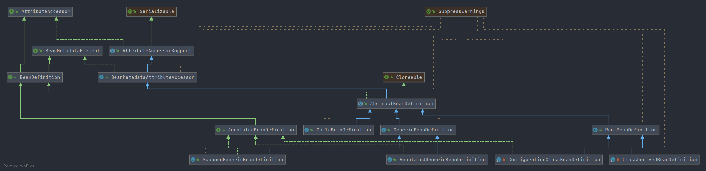

# Spring BeanDefinition 阅读路线
- 本节主要围绕`BeanDefinition`接口进行展开,介绍接口方法和实现类. 
    `BeanDefinition` 接口主要定义 Spring 中 Bean 的一些基本信息的 `get` 和 `set` 方法. 
    详细内容请查阅下面文档.
    
    详细阅读流程围绕类图
    
    
    
## 相关文章
- [BeanDefinition](/docs/beans/BeanDefinition/Spring-BeanDefinition.md)
    - AnnotatedBeanDefinition
        - [ScannedGenericBeanDefinition](/docs/beans/BeanDefinition/Spring-ScannedGenericBeanDefinition.md)
        - [ConfigurationClassBeanDefinition](/docs/beans/BeanDefinition/Spring-ConfigurationClassBeanDefinition.md)
        - [AnnotatedGenericBeanDefinition](/docs/beans/BeanDefinition/Spring-AnnotatedGenericBeanDefinition.md)
  - [AbstractBeanDefinition](/docs/beans/BeanDefinition/Spring-AbstractBeanDefinition.md)
        - [RootBeanDefinition](/docs/beans/BeanDefinition/Spring-RootBeanDefinition.md)
            - [ConfigurationClassBeanDefinition](/docs/beans/BeanDefinition/Spring-ConfigurationClassBeanDefinition.md)
            - [ClassDerivedBeanDefinition](/docs/beans/BeanDefinition/Spring-ConfigurationClassBeanDefinition.md)
        - [ChildBeanDefinition](/docs/beans/BeanDefinition/Spring-ConfigurationClassBeanDefinition.md)
        - [GenericBeanDefinition](/docs/beans/BeanDefinition/Spring-GenericBeanDefinition.md)
            - [ScannedGenericBeanDefinition](/docs/beans/BeanDefinition/Spring-ScannedGenericBeanDefinition.md)
            - [AnnotatedGenericBeanDefinition](/docs/beans/BeanDefinition/Spring-AnnotatedGenericBeanDefinition.md)