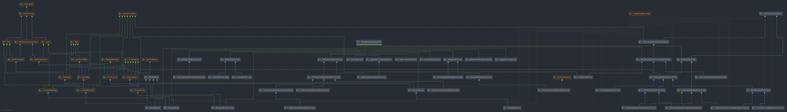

# Spring BeanMetadataElement
- 本节主要围绕 BeanMetadataElement 接口做展开, 分析 BeanMetadataElement 接口的作用和子类实现的细节. 
    BeanMetadataElement 是 Spring-xml 配置方式, 将 xml 配置文件和 Java 对象做映射的一个类. 通过了解 BeanMetadataElement 接口及其实现类, 
    可以让我们直接了解到 xml 和 Spring Java 的关系. 
    
    
    
    
    
## 相关文章
- [Spring-AliasDefinition](/docs/beans/BeanMetadataElement/Spring-AliasDefinition.md)
- [Spring-AutowireCandidateQualifier](/docs/beans/BeanMetadataElement/Spring-AutowireCandidateQualifier.md)
- [Spring-BeanComponentDefinition](/docs/beans/BeanMetadataElement/Spring-BeanComponentDefinition.md)
- [Spring-BeanDefinitionHolder](/docs/beans/BeanMetadataElement/Spring-BeanDefinitionHolder.md)
- [Spring-BeanMetadataAttribute](/docs/beans/BeanMetadataElement/Spring-BeanMetadataAttribute.md)
- [Spring-ConstructorArgumentValues.ValueHolder](/docs/beans/BeanMetadataElement/Spring-ConstructorArgumentValues.ValueHolder.md)
- [Spring-DocumentDefaultsDefinition](/docs/beans/BeanMetadataElement/Spring-DocumentDefaultsDefinition.md)
- [Spring-ImportDefinition](/docs/beans/BeanMetadataElement/Spring-ImportDefinition.md)
- [Spring-ManagedList](/docs/beans/BeanMetadataElement/Spring-ManagedList.md)
- [Spring-ManagedMap](/docs/beans/BeanMetadataElement/Spring-ManagedMap.md)
- [Spring-ManagedProperties](/docs/beans/BeanMetadataElement/Spring-ManagedProperties.md)
- [Spring-ManagedSet](/docs/beans/BeanMetadataElement/Spring-ManagedSet.md)
- [Spring-MethodOverride](/docs/beans/BeanMetadataElement/Spring-MethodOverride.md)
- [Spring-TypedStringValue](/docs/beans/BeanMetadataElement/Spring-TypedStringValue.md)
- [Mergeable](/docs/beans/BeanMetadataElement/Mergeable/Readme.md)
- [Spring-BeanReference](/docs/beans/BeanMetadataElement/BeanReference/Spring-BeanReference.md)
- [Spring-RuntimeBeanNameReference](/docs/beans/BeanMetadataElement/BeanReference/Spring-RuntimeBeanNameReference.md)
- [Spring-RuntimeBeanReference](/docs/beans/BeanMetadataElement/BeanReference/Spring-RuntimeBeanReference.md)
- [ComponentDefinition](/docs/beans/ComponentDefinition/Readme.md)