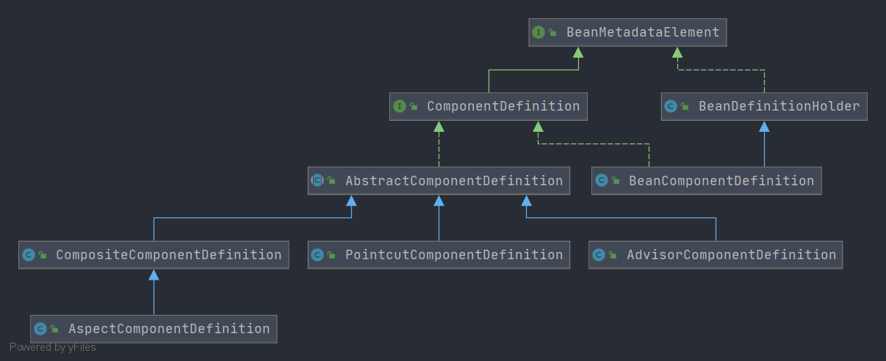

# Spring ComponentDefinition 阅读路线
- 本节将介绍 Spring 组件定义. 相关接口为`ComponentDefinition`. 通过本节将进一步了解 **组件定义** 的内容

## 阅读路线
- 从接口`ComponentDefinition`触发, 先了解接口定义了那些行为, 在了解详细的实现类

## 相关文章
- [ComponentDefinition](/docs/beans/ComponentDefinition/Spring-ComponentDefinition.md)
    - [AbstractComponentDefinition](/docs/beans/ComponentDefinition/Spring-AbstractComponentDefinition.md)
        - [CompositeComponentDefinition](/docs/beans/ComponentDefinition/Spring-CompositeComponentDefinition.md)
            - [AspectComponentDefinition](/docs/beans/ComponentDefinition/Spring-AspectComponentDefinition.md)
        - [PointcutComponentDefinition](/docs/beans/ComponentDefinition/Spring-PointcutComponentDefinition.md)
        - [AdvisorComponentDefinition](/docs/beans/ComponentDefinition/Spring-AdvisorComponentDefinition.md)
    - [BeanComponentDefinition](/docs/beans/BeanMetadataElement/Spring-BeanComponentDefinition.md)