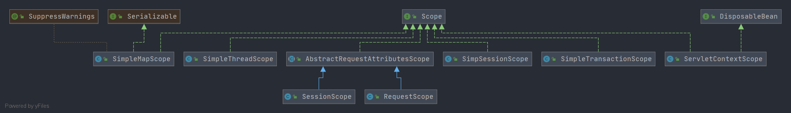

<!--
  ~
  ~ Copyright 2020 HuiFer All rights reserved.
  ~
  ~ Licensed under the Apache License, Version 2.0 (the "License");
  ~ you may not use this file except in compliance with the License.
  ~ You may obtain a copy of the License at
  ~
  ~      http://www.apache.org/licenses/LICENSE-2.0
  ~
  ~ Unless required by applicable law or agreed to in writing, software
  ~ distributed under the License is distributed on an "AS IS" BASIS,
  ~ WITHOUT WARRANTIES OR CONDITIONS OF ANY KIND, either express or implied.
  ~ See the License for the specific language governing permissions and
  ~ limitations under the License.
  ~
  -->

# Spring Scope

- 类全路径: `org.springframework.beans.factory.config.Scope`

- 类图

  


## 方法列表


```java
public interface Scope {

   /**
    * 从容器中获取 name 对应的实例 , 如果没有从 ObjectFactory 创建
    */
   Object get(String name, ObjectFactory<?> objectFactory);

   /**
    * 删除 name 对应的实例
    */
   @Nullable
   Object remove(String name);

   /**
    * 注册摧毁bean的回调方法
    */
   void registerDestructionCallback(String name, Runnable callback);

   /**
    * 解析上下文
    */
   @Nullable
   Object resolveContextualObject(String key);

   /**
    * 获取会话ID
    */
   @Nullable
   String getConversationId();

}
```


详细分析就在实现类上. 这里仅作为一个方法说明


### 简单逻辑概述

#### get

- 从某个容器中根据name获取实例
  - 实例不存在
    - 从ObjectFactory中获取
      - 放入容器


#### remove

- 从容器中根据 name 删除实例
- 根据需要决定是否删除 name 对应的回调方法(Runnable)


#### registerDestructionCallback

- 注册摧毁方法

  name -> runnable 绑定


## 实现类分析


- [Spring-AbstractRequestAttributesScope](/docs/beans/Scope/Spring-AbstractRequestAttributesScope.md)
- [Spring-ServletContextScope](/docs/beans/Scope/Spring-ServletContextScope.md)
- [Spring-SimpleMapScope](/docs/beans/Scope/Spring-SimpleMapScope.md)
- [Spring-SimpleThreadScope](/docs/beans/Scope/Spring-SimpleThreadScope.md)
- [Spring-SimpleTransactionScope](/docs/beans/Scope/Spring-SimpleTransactionScope.md)
- [Spring-SimpSessionScope](/docs/beans/Scope/Spring-SimpSessionScope.md)