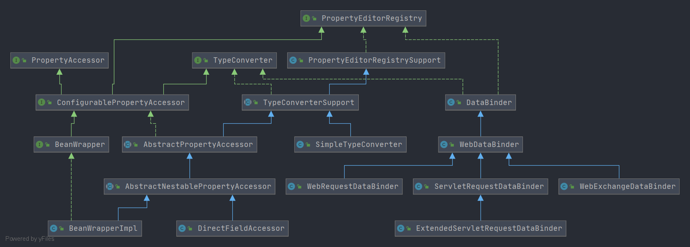

<!--
  ~
  ~ Copyright 2020 HuiFer All rights reserved.
  ~
  ~ Licensed under the Apache License, Version 2.0 (the "License");
  ~ you may not use this file except in compliance with the License.
  ~ You may obtain a copy of the License at
  ~
  ~      http://www.apache.org/licenses/LICENSE-2.0
  ~
  ~ Unless required by applicable law or agreed to in writing, software
  ~ distributed under the License is distributed on an "AS IS" BASIS,
  ~ WITHOUT WARRANTIES OR CONDITIONS OF ANY KIND, either express or implied.
  ~ See the License for the specific language governing permissions and
  ~ limitations under the License.
  ~
  -->

# Spring PropertyEditorRegistry

- 类全路径:`org.springframework.beans.PropertyEditorRegistry`

- 类图: 

  


## 方法列表

- 首先进行接口方法的说明， 简单概述方法作用


- 先看一下方法列表

```java
    void registerCustomEditor(Class<?> requiredType, PropertyEditor propertyEditor);

   void registerCustomEditor(@Nullable Class<?> requiredType, @Nullable String propertyPath, PropertyEditor propertyEditor);

   PropertyEditor findCustomEditor(@Nullable Class<?> requiredType, @Nullable String propertyPath);
```


- 前两个方法都是将 class 和 PropertyEditor 进行一个绑定
- 最后一个方法用来寻找 PropertyEditor


- `propertyPath`: 属性名称或者嵌套位置


接下来围绕类图来了解实现方法

- [Spring-PropertyEditorRegistrySupport.md](/docs/beans/propertyEditor/Spring-PropertyEditorRegistrySupport.md)