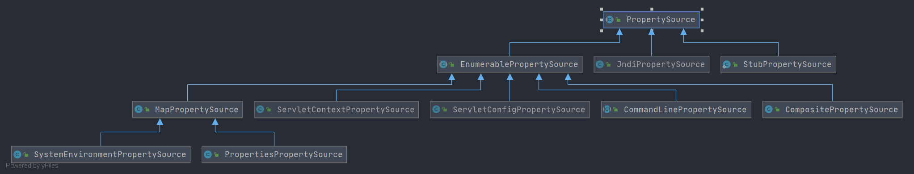

# Spring PropertySource
- `PropertySource` 在 Spring 中承担着提供属性源的一个作用. 其提供了**获取属性名称**、**获取属性值** 等方法. 
    Spring 也对其做了多种实现. 各位读者可以通过类图进行查看
    
    
- 类解析
    - [StubPropertySource](/docs/env/PropertyResolver/PropertySource/Spring-StubPropertySource.md)
        - [ComparisonPropertySource](/docs/env/PropertyResolver/PropertySource/Spring-ComparisonPropertySource.md)
    - [EnumerablePropertySource](/docs/env/PropertyResolver/PropertySource/Spring-EnumerablePropertySource.md)
        - [CompositePropertySource](/docs/env/PropertyResolver/PropertySource/Spring-CompositePropertySource.md)
        - [CommandLinePropertySource](/docs/env/PropertyResolver/PropertySource/Spring-CommandLinePropertySource.md)
            - [SimpleCommandLinePropertySource](/docs/env/PropertyResolver/PropertySource/Spring-SimpleCommandLinePropertySource.md)
        - [MapPropertySource](/docs/env/PropertyResolver/PropertySource/Spring-MapPropertySource.md)
            - [PropertiesPropertySource](/docs/env/PropertyResolver/PropertySource/Spring-PropertiesPropertySource.md)
                - [ResourcePropertySource](/docs/env/PropertyResolver/PropertySource/Spring-ResourcePropertySource.md)
                - [MockPropertySource](/docs/env/PropertyResolver/PropertySource/Spring-MockPropertySource.md)
            - [SystemEnvironmentPropertySource](/docs/env/PropertyResolver/PropertySource/Spring-SystemEnvironmentPropertySource.md)
        - [ServletConfigPropertySource](/docs/env/PropertyResolver/PropertySource/Spring-ServletConfigPropertySource.md)
        - [ServletContextPropertySource](/docs/env/PropertyResolver/PropertySource/Spring-ServletContextPropertySource.md)
