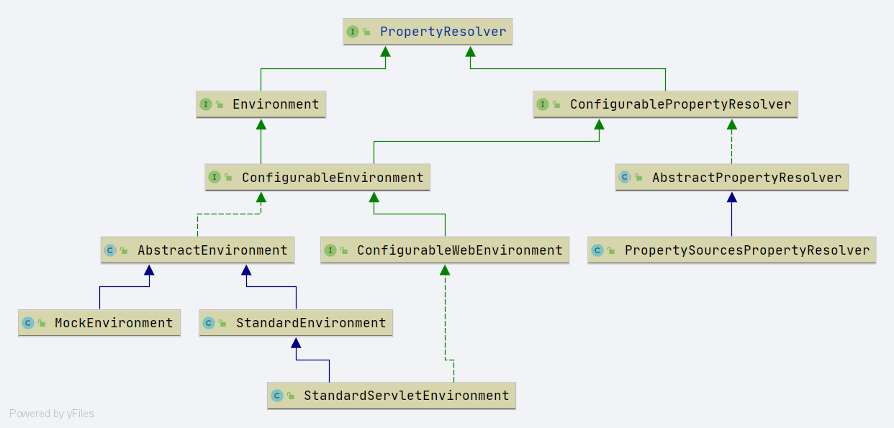

# Spring env PropertyResolver
- 本节介绍 Spring 环境相关的属性解析类. 围绕类图
     
    进行展开.
    其中类图中可以发现存在两个子类接口**Environment**、**ConfigurablePropertyResolver**. 通过这两个接口继续往下查看, 看到其所有子类. 自上而下的进行源码阅读. 
    
    

- Environment 接口实现类阅读路线: 
    - [AbstractEnvironment](/docs/env/environment/Spring-AbstractEnvironment.md)
        - [StandardEnvironment](/docs/env/environment/Spring-StandardEnvironment.md)
            - [StandardServletEnvironment](/docs/env/environment/Spring-StandardServletEnvironment.md)
        - [MockEnvironment](/docs/env/environment/Spring-MockEnvironment.md)
    
    
- ConfigurablePropertyResolver 接口实现类阅读路线: 
    - [AbstractPropertyResolver](/docs/env/PropertyResolver/Spring-AbstractPropertyResolver.md)
        - [PropertySourcesPropertyResolver](/docs/env/PropertyResolver/Spring-PropertySourcesPropertyResolver.md)
            - 其中 **AbstractEnvironment**也实现了`ConfigurablePropertyResolver`也是需要阅读相关方法来进行详细了解
            - [AbstractEnvironment](/docs/env/environment/Spring-AbstractEnvironment.md)
                - [StandardEnvironment](/docs/env/environment/Spring-StandardEnvironment.md)
                    - [StandardServletEnvironment](/docs/env/environment/Spring-StandardServletEnvironment.md)
                - [MockEnvironment](/docs/env/environment/Spring-MockEnvironment.md)
                
                
                
                
                
- 其实,关于 PropertyResolver 接口中还不免遇到一些工具类, 或者提供帮助的类,这些类在`PropertyResolver`接口实现中有着相对重要的用处. 在这里列出几个重点类
    1. [PropertySource](/docs/env/PropertyResolver/PropertySource/Readme.md)
    2. [PlaceholderResolver](/docs/env/PropertyResolver/PlaceholderResolver/Readme.md)
    